# MowMate

**MowMate** is the standalone companion UI and control center for the
[ArduMower](https://www.ardumower.de/). It runs on the mower and provides the
main web UI, map editing, route planning, live data, and remote control without
requiring additional tools.

It keeps the Bluetooth LE and HTTP connectivity known from the `esp32_ble`
sketch in the [Sunray](https://github.com/ardumower/Sunray) repository and
adds MQTT, Home Assistant discovery, Prometheus, OTA updates, and local map
handling.

**Origin:** This project was originally started by Tim Otto as [ardumower-modem](https://github.com/timotto/ardumower-modem). The current version continues that work as [MowMate](https://github.com/Zwer2k/ardumower-mowmate) with the extended feature set described below.

## Overview

MowMate sits between the user and the Sunray mower controller. It collects
mower data, serves the web interface, stores map metadata, calculates mowing
routes on ESP32-S3 hardware, and uploads compatible map coordinates to Sunray.
Instead of relying on an external app, it can now be used as the main Ardumower
UI directly from the browser.

Compatibility with external tools remains: the same BLE and HTTP interface is
still available for the [ArduMower App by Grauonline](https://www.grauonline.de/am/)
and for [CaSSAndRA](https://github.com/Ernie3/caSSAndRA), so MowMate can also
continue to act as the connectivity bridge for those applications.

Main capabilities:

- Responsive embedded web interface served directly from the ESP32.
- WiFi station mode and first-setup access-point mode.
- Bluetooth LE connectivity compatible with the original Sunray ESP32 BLE
	workflow.
- WebSocket-based live data, commands, map transfer, logs, and progress.
- Serial routing between modem and mower, including an interactive mower
	terminal on ESP32-S3 builds.
- Mower status, statistics, sensors, GPS details, UBX output, driven track,
	and obstacle display.
- Local map editing, map persistence in SPIFFS, map list management, import,
	export, route calculation, and Sunray-compatible upload.
- Mowing schedules, manual control, browser gamepad support, OTA updates, and
	optional MQTT, Home Assistant discovery, and Prometheus integration.

## Architecture

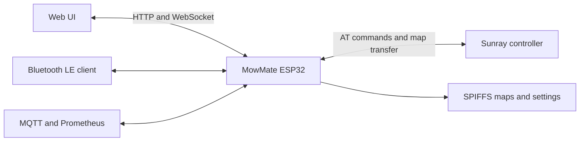

The web UI is built with Svelte and packaged into the firmware image. MowMate
exposes the same mower-facing protocol over WiFi and BLE while keeping
the Sunray serial protocol internal.

## Supported Hardware

Two build targets are maintained:

| Target | Intended board | Map and UI features |
|---|---|---|
| `esp32` | ESP32 / Wemos D1 Mini 32 | Base modem functions. |
| `esp32-S3` | ESP32-S3 DevKitC-1 or ESP32-S3-WROOM-1 with 16 MB flash and OPI PSRAM | Full map planner, live map, GPS dashboard, mower terminal, and embedded full UI. |

The ESP32-S3 environment uses the `default_16MB.csv` partition layout and is
the supported target for advanced map functionality. ESP32-S3 does not support
Bluetooth Classic, therefore direct PS4-controller pairing is unavailable on
that target. Browser gamepad control remains available.

## Connectivity and Control

### WiFi and Web Interface

On first boot MowMate starts an access point named `ArduMower Modem` with
password `ArduMower Modem`. Connect to it and open
[http://192.168.4.1/](http://192.168.4.1/) to configure WiFi, security, and
integrations. Once station credentials are configured, MowMate joins the
local network and serves the same interface at its assigned address.

The interface uses HTTP for static assets and a WebSocket for live updates.
Map transfers are chunked to avoid oversized WebSocket frames.

### Bluetooth LE

MowMate provides the BLE communication workflow used by the Sunray mobile
application. BLE and WiFi may run concurrently on ESP32-S3; this is more
resource-sensitive than WiFi-only use and should be tested with the actual
board and firmware combination.

### Manual Control

The web UI can send mower commands and offers:

- Start, stop, dock, reboot, power-off, skip-waypoint, and status/statistics
	requests.
- Virtual joystick and Web Gamepad API control.
- Mow motor, speed, fix timeout, mowing height, sonar, and waypoint percentage
	controls where supported by the attached Sunray firmware.
- A live terminal for direct mower commands on ESP32-S3 builds with
	`MOWER_TERMINAL` enabled and a suitable additional Sunray serial connection.

## Map Management and Route Calculation

The map editor supports a persistent map model with these independent objects:

| Object | Purpose |
|---|---|
| Perimeter | Closed outer boundary of the mowing area. |
| Exclusions | Closed forbidden areas inside the perimeter. |
| Dockpoints | Docking and undocking line. |
| Waypoints | Calculated mowing route. |

Maps can be created and edited in the browser, calculated, saved to SPIFFS,
listed, loaded, renamed, deleted, imported, exported, and uploaded to Sunray.
The UI supports the legacy Grauonline JSON map format and CaSSAndRA GeoJSON.
GeoJSON carries perimeter, exclusions, dockpoints, and Search Wire as separate
features.

Maps transferred through the ArduMower App by Grauonline or CaSSAndRA can be
intercepted by MowMate and cached locally, so they remain available for
editing, recalculation, persistence, and reuse in the MowMate UI.

The ESP32-S3 path planner provides three area patterns:

- **Lines:** Parallel mowing lanes at the configured angle.
- **Squares:** Two perpendicular Lines passes.
- **Rings:** Inward offset contours.

`width` controls Area-lane spacing. `distanceToBorder` moves the normal Area
geometry inward by `distanceToBorder * width`. `borderLaps` creates exactly the
configured number of separate perimeter laps; it is not a width-dependent
border strip.

Calculated waypoint segments carry compact MowMate/UI metadata:

| Category | Meaning |
|---|---|
| `AREA` | Normal Lines, Squares, or Rings coverage route. |
| `BORDER` | Explicit perimeter lap generated from `borderLaps`. |
| `EXCLUSION_BORDER` | Explicit route around an exclusion. |
| `CONNECTOR` | Safe connection between route sections. |
| `TRANSIT` | Reserved planned transition between separate map sections. |

The Area, Border, and Exclusion Border switches filter this full route at
runtime. A safe connector between two Area sections remains with Area; a
connector between Area and Border remains only while both sections are active.
The UI renders separated route fragments independently so hiding a category
cannot draw a straight line through or outside the perimeter.

Search Wire is a MowMate-only planning geometry. Valid segments are preferred by
the connector pathfinder but are rejected if they leave the perimeter or touch
an exclusion. It is not inserted into the mowing route.

For the complete algorithm, tag model, WebSocket flow, export rules, diagnostics,
and Sunray protocol mapping, see [Map calculation documentation](docs/map-calculation.md).

### Sunray Map Compatibility

Sunray receives coordinate arrays only. MowMate uploads the perimeter,
exclusions, dockpoints, and filtered mowing waypoints in separate groups, then
sends their counts. Sunray uses the perimeter as a safety boundary, dockpoints
for its own docking sequence, and mowing waypoints as the route to follow.

Route tags, connector metadata, and Search Wire are not sent to Sunray. This
keeps the map upload compatible with Sunray while allowing the MowMate UI to
control Area/Border visibility and upload selection.

### Schedules and Progress

MowMate manages scheduled mower operations and exposes their state through
the UI. Long-running route calculations, map uploads, clear operations, OTA
updates, and related workflows send progress messages over WebSocket.

## Requirements

Before building or flashing the firmware, install the following tools:

- Node.js and npm (required for building the web UI)
- Go (required for packaging the web UI into `src/asset_bundle.h`)
- PlatformIO CLI (recommended for firmware builds)
- Arduino CLI (optional, only required for `task compile`)
- `task` from [Taskfile](https://taskfile.dev/) to run the repository automation tasks

## Hardware Pinout

The ESP32-S3 pinout (GPIO assignments for STM32 communication, OTA control, and debug console) is described in the separate [Pinout documentation](docs/pinout.md). It applies to the **ESP32-S3-DevKitC-1** development board as well as to soldering an **ESP32-S3-WROOM-1 module** directly onto a custom PCB.

## Flashing the MowMate firmware

Flashing the firmware onto the ESP32 for the first time requires some effort. Subsequent updates can be installed comfortably using the MowMate web interface.

### Pre-built binaries

Download the latest release binary from the [releases page](https://github.com/Zwer2k/ardumower-mowmate/releases). Use the [modem_install](util/modem_install/modem_install.ino) Arduino Sketch (from the `util` folder of the release) to flash it onto your ESP32. This Sketch requires nothing but a vanilla Arduino setup with the ESP32 package installed. No additional libraries are required.

### Compiling with PlatformIO (recommended)

Install [PlatformIO](https://platformio.org/) and run:
```
task compile-pio PIO_ENV=esp32-S3-N16-R8
```
For the ESP32 variant:
```
task compile-pio PIO_ENV=esp32
```

The `compile-pio` task depends on `package-ui`, so the UI is built and packaged automatically before the firmware build starts.

If `pio` is not on your PATH, the Taskfile currently calls the local PlatformIO venv executable at `~/.platformio/penv/bin/pio`.

### Compiling with Arduino CLI

Install the [Arduino CLI](https://github.com/arduino/arduino-cli) and the ESP32 core, then run:
```
task compile ESP_TARGET=esp32 VARIANT=ESP_MODEM_APP
```
For ESP32-S3:
```
task compile ESP_TARGET=esp32-S3 VARIANT=ESP_MODEM_APP
```

**Note for ESP32-S3:** When using an ESP32-S3 with 16 MB flash (e.g., `esp32-s3-devkitc-1`), the partition scheme `default_16MB.csv` is required. In PlatformIO this is configured via `board_build.partitions = default_16MB.csv` in the S3 environment (see `platformio.ini`).

## First time WiFi setup

Once the firmware is running it will start a WiFi access point called `ArduMower Modem` with the password `ArduMower Modem`. Connect to that access point to access the Modem's web interface at [http://192.168.4.1/](http://192.168.4.1/). From there you are able to configure your WiFi credentials, Bluetooth security settings and everything else.

## Features

MowMate provides full insight and control over the ArduMower through its web interface.

### Dashboard

#### Main Dashboard

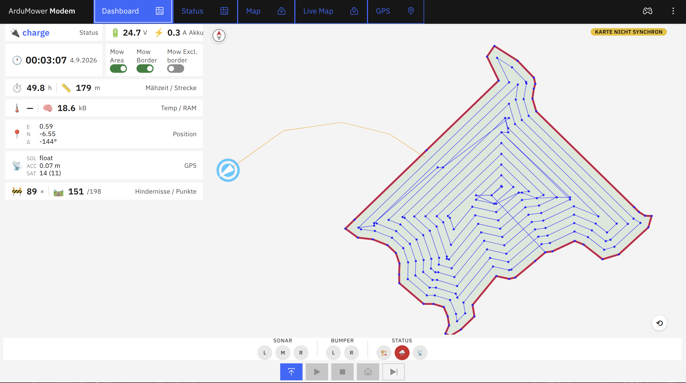

The redesigned main dashboard gives a quick overview of the most important mower status values: battery voltage and charge current, mowing duration and distance, CPU temperature, free heap, position, GPS solution status, obstacle counter, and a compact MiniMap. The MiniMap shows the loaded perimeter, docking station, driven track, and planned waypoints with tags for area, border, exclusion border and connectors. Use the toggles above the map to switch between route patterns (Lines, Squares, Rings) and the track history window.

#### Status

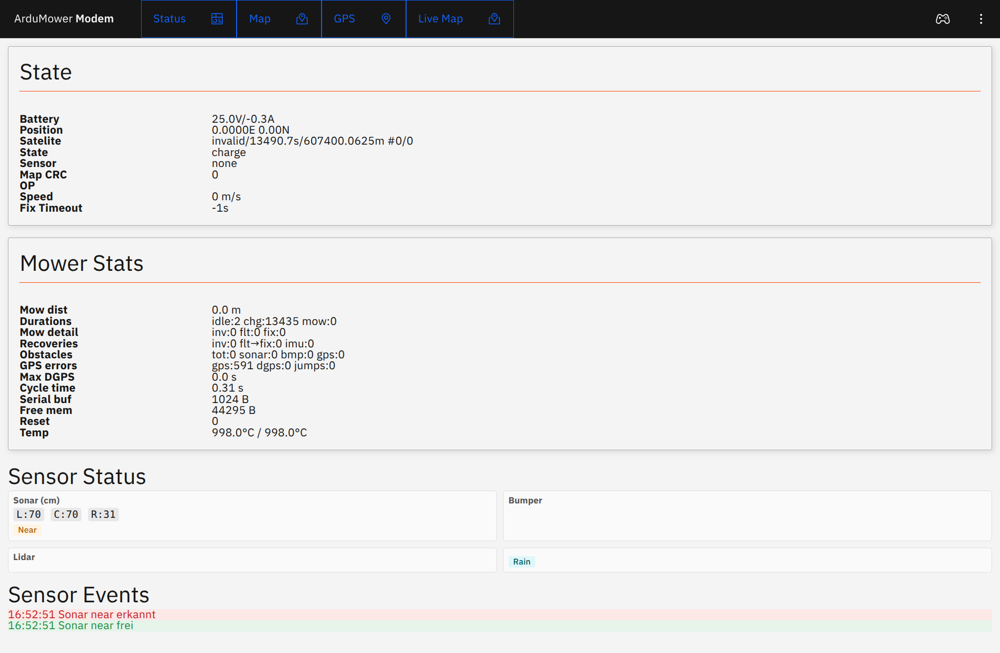

Real-time status overview including battery, position, satellite fix, current state, sensor data, speed, fix timeout, mower stats (distances, durations, recoveries, obstacles, temperatures), and sensor events.

#### Map

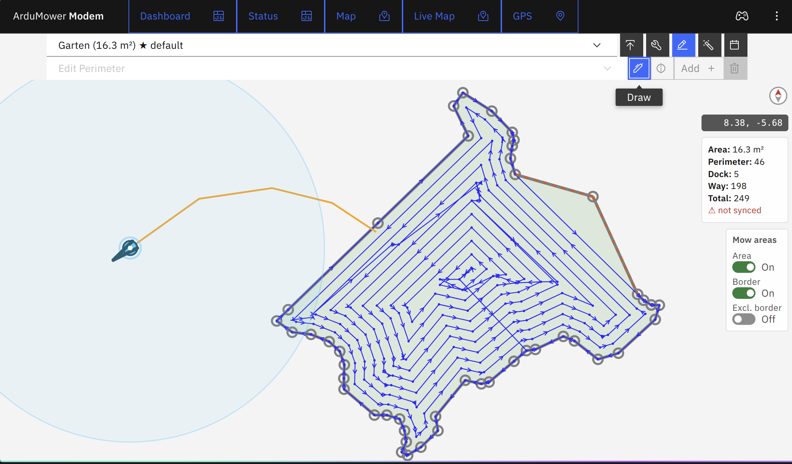

Visualizes the mower map with perimeter, exclusions, docking station, planned mowing points, and driven tracks. The route can be recalculated on the device and is shown with planner-generated tags (area, border, exclusion border, connector, transit). Maps can be imported and exported in ArduMower/Grauonline JSON or CaSSAndRA GeoJSON format; search-wire, exclusions, and docking points are preserved in the GeoJSON export.

#### GPS

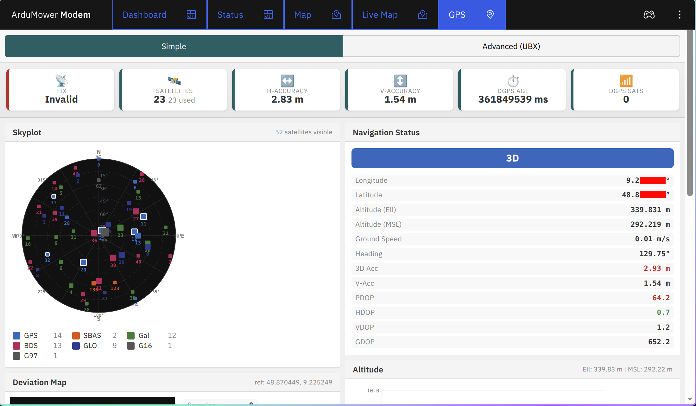

Detailed GPS information with satellite skyplot, position data, DGPS status, and signal quality. Requires a customized Sunray firmware that includes the GPS details response.

#### Live Map

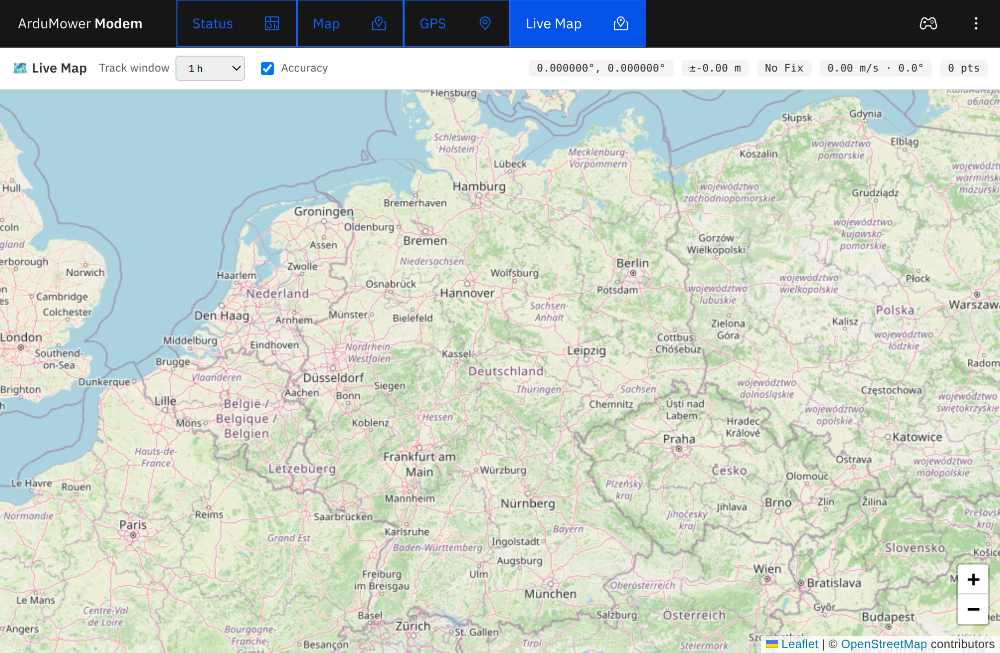

Real-time tracking on an OpenStreetMap background with configurable track window and accuracy overlay.

### Remote Control

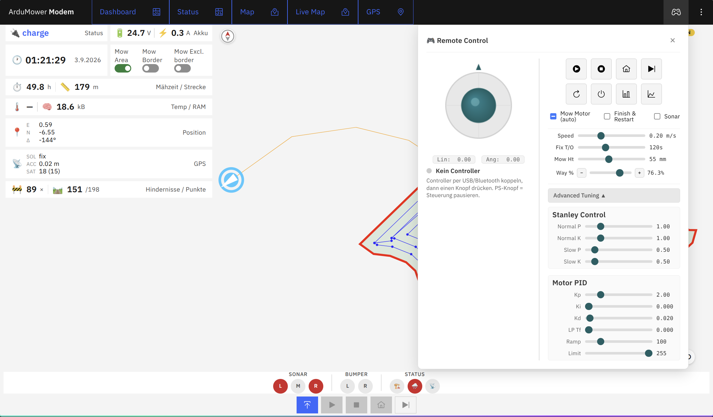

Full manual control of the mower including:
- Virtual joystick for driving (linear/angular speed)
- Start, Stop, Dock, Skip Waypoint, Reboot, Power Off buttons
- Request Stats and Request Status buttons
- Mow motor toggle, Finish & Restart, Sonar
- Adjustable speed, fix timeout, mowing height, and waypoint percentage

### Log

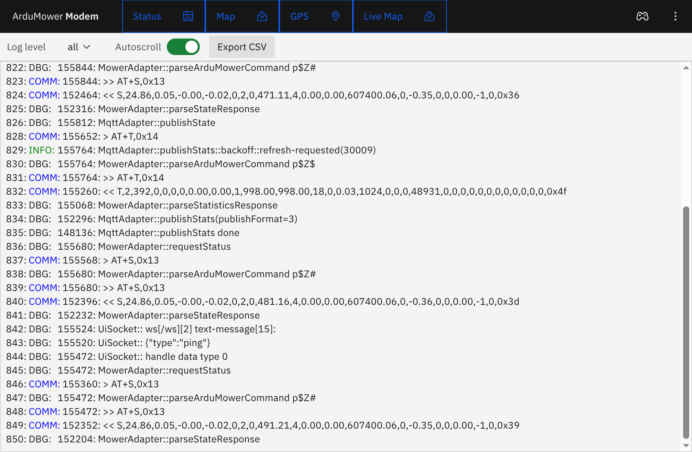

Filterable, searchable log output with configurable log level, autoscroll, and CSV export.

### Terminal

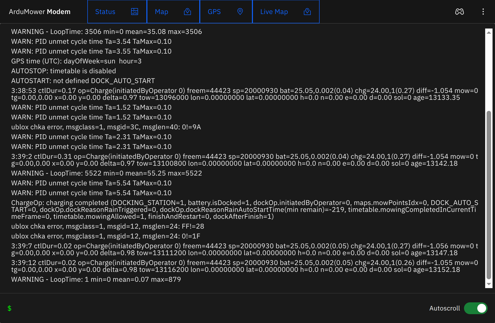

Interactive terminal to send commands to the mower and view responses in real time. Available on the ESP32-S3 variant (requires `MOWER_TERMINAL` compile flag). Requires the Sunray firmware to be configured with an additional serial connection (`Serial2`) for the terminal communication.

### Motor-Test

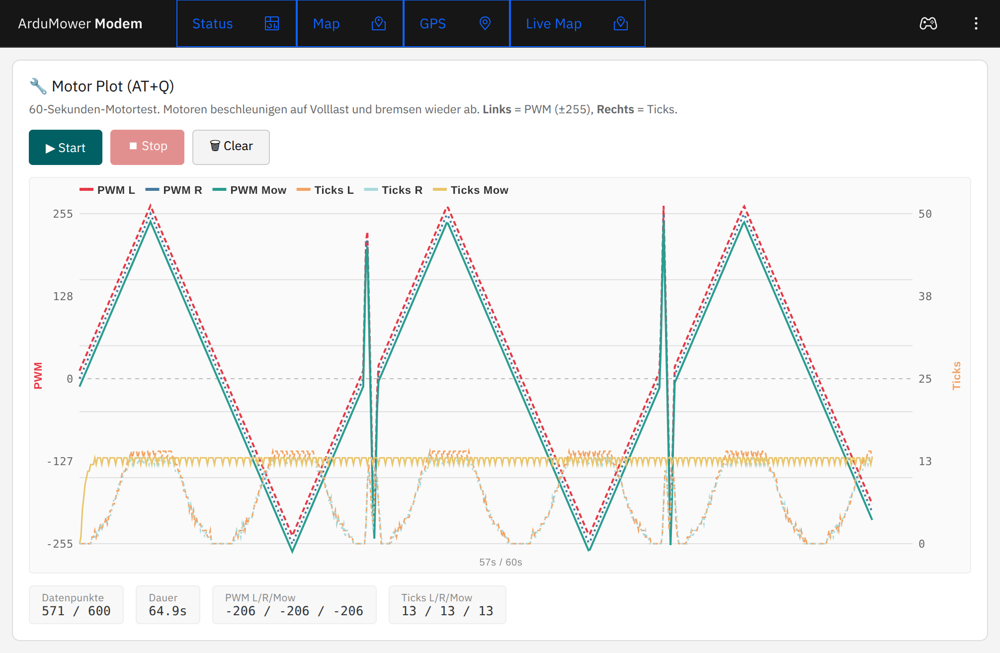

Motor plot test (60s motor ramp test) with safety confirmation and live PWM/tick visualization.

### Settings

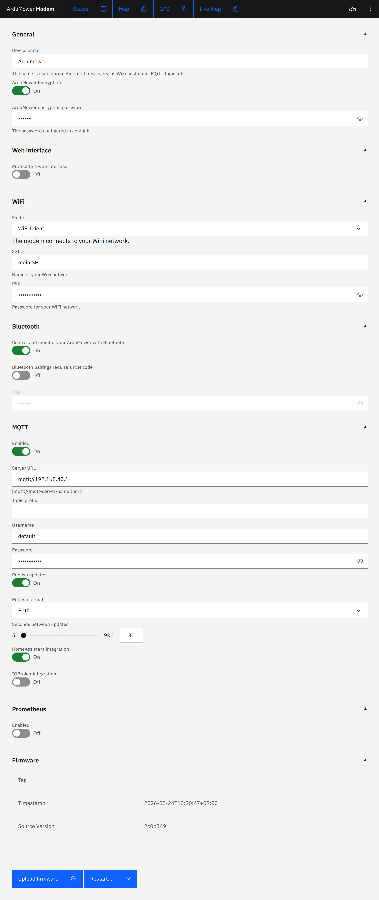

Configuration of WiFi, Bluetooth, MQTT, Prometheus, PS4 controller, and OTA updates. OTA flashing of the Sunray firmware (STM32) requires trigger lines (`BOOT0` on GPIO 5, `NRST` on GPIO 7) between the ESP32 and the STM32. See [Pinout](docs/pinout.md) for details.

### Integrations

#### MQTT

MowMate supports MQTT for status reporting and control. It has support for HomeAssistant Autodiscovery as a vacuum cleaner and ioBroker integration. This integrates nicely with Google Assistant, and I'm pretty sure with Alexa as well.

#### Prometheus

The Prometheus endpoint of MowMate makes it easy to collect metrics about the ArduMower and MowMate itself.

#### PS4 Controller / Gamepad

The robotic lawnmower can be controlled with a gamepad. Multiple controller brands are supported, not only PS4. The controller can be connected via a computer, laptop, or smartphone.

- left joystick -> fast movements
- right joystick -> slow movements
- cross + R2 -> linear movements + rotation on the spot
- triangle -> start automatic mowing
- rectangle -> stop automatic mowing
- circle -> mowing motor on/off
- cross -> skip next mowing point
- L1 -> reduce mowing speed
- R1 -> increase mowing speed

Configuration is done via the web interface.

**Note for ESP32-S3:** The S3 variant lacks Bluetooth Classic hardware, so direct PS4 controller pairing is not supported. Instead, use joystick input via the browser (Web Gamepad API) or system-integrated joysticks on a connected computer/laptop/smartphone.


## Dependencies

### Development Environment

The sketch is compiled with [PlatformIO](https://platformio.org/). All automation is orchestrated by a [Taskfile](https://taskfile.dev/).
Building the web interface requires Node JS. The tools to package the web interface and to run the validation tests require Go.


### Arduino Libraries

All libraries are managed via PlatformIO:

- [NimBLE-Arduino](https://github.com/h2zero/NimBLE-Arduino) - Bluetooth LE connectivity
- [ArduinoJson](https://arduinojson.org/) - JSON serialization
- [MQTT](https://github.com/256dpi/arduino-mqtt) - MQTT client for home automation
- [AUnit](https://github.com/bxparks/AUnit) - Unit testing
- [ArduinoWebsockets](https://github.com/gilmaimon/ArduinoWebsockets) - WebSocket communication
- [AsyncTCP](https://github.com/ESP32Async/AsyncTCP) - Async TCP library
- [ESPAsyncWebServer](https://github.com/ESP32Async/ESPAsyncWebServer) - Async web server

### Automation

[Taskfile.yml](Taskfile.yml) defines tasks for compilation, upload, and more. Compilation can be done either via PlatformIO (`compile-pio`) or via Arduino CLI (`compile`).

**Key tasks:**

| Task | Description |
|------|-------------|
| `build-ui` | Build the web UI |
| `package-ui` | Package web UI as a header file |
| `compile-pio` | Compile with PlatformIO |
| `compile` | Compile with Arduino CLI |
| `build` | Build all variants (firmware, sim, test) |
| `build-firmware` | Build the firmware variant |
| `flash` | Flash firmware via serial |
| `run` | Build + flash + serial monitor |
| `ota` | Update firmware via OTA |
| `validate` | Run integration tests |
| `clean` | Remove build artifacts |

**Task parameters (as environment variables or via `--`):**

| Variable | Default | Description |
|----------|---------|-------------|
| `ESP_TARGET` | `esp32` | Target platform (`esp32` or `esp32-S3`) |
| `VARIANT` | `ESP_MODEM_APP` | Build variant (`ESP_MODEM_APP`, `ESP_MODEM_SIM`, `ESP_MODEM_TEST`) |
| `PIO_ENV` | `esp32-S3-N16-R8` | PlatformIO environment |
| `SERIAL_PORT` | – | Serial port for flash/monitor |
| `ESP_DEV_IP` | – | ESP IP address for OTA |
| `ESP_DEV_CREDS` | – | OTA credentials (`user:pass`) |

Example:
```
task compile-pio PIO_ENV=esp32
task flash SERIAL_PORT=/dev/ttyUSB0 VARIANT=ESP_MODEM_SIM
task ota ESP_DEV_IP=192.168.43.220 ESP_DEV_CREDS=admin:secret
```

## Gratitude

My ArduMower is my only lawn mower. It saved me countless hours of manual labor which I was able to spend tinkering with this source code and other hobbies.

I am very grateful to the ArduMower community for building an awesome hardware and software platform and making it available to the public. With this contribution I want to become an active member of the ArduMower community.

## License

ArduMower MowMate - Firmware for the ESP32-S3 connected as controller and modem to an ArduMower
Copyright (c) 2026 Jurij Retzlaff

Permission is hereby granted, free of charge, to any person obtaining a copy
of this software and associated documentation files (the "Software"), to deal
in the Software without restriction, including without limitation the rights
to use, copy, modify, merge, publish, distribute, sublicense, and/or sell
copies of the Software, and to permit persons to whom the Software is
furnished to do so, subject to the following conditions:

The above copyright notice and this permission notice shall be included in all
copies or substantial portions of the Software.

THE SOFTWARE IS PROVIDED "AS IS", WITHOUT WARRANTY OF ANY KIND,
EXPRESS OR IMPLIED, INCLUDING BUT NOT LIMITED TO THE WARRANTIES OF
MERCHANTABILITY, FITNESS FOR A PARTICULAR PURPOSE AND NONINFRINGEMENT.
IN NO EVENT SHALL THE AUTHORS OR COPYRIGHT HOLDERS BE LIABLE FOR ANY CLAIM,
DAMAGES OR OTHER LIABILITY, WHETHER IN AN ACTION OF CONTRACT, TORT OR
OTHERWISE, ARISING FROM, OUT OF OR IN CONNECTION WITH THE SOFTWARE OR THE USE
OR OTHER DEALINGS IN THE SOFTWARE.

