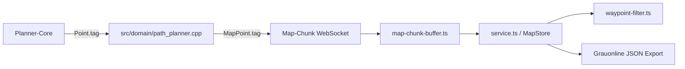

# Kartenberechnung und Routensemantik

Diese Dokumentation beschreibt die Kartenberechnung im Ardumower-Modem. Sie trennt die dauerhaft gezeichnete Karte von der berechneten Mähroute, der Anzeige im Web-UI und dem Upload zu Sunray.

## Begriffe und Datenmodell

Eine Karte besteht aus eigenständigen Geometrieobjekten und einer berechneten Route. Diese beiden Ebenen dürfen nicht verwechselt werden.

| Objekt | Feld | Geometrie | Zweck |
|---|---|---|---|
| Perimeter | `MowerMap::perimeter` | geschlossenes Polygon | Gezeichnete Außenbegrenzung und Sicherheitsgrenze. |
| Exclusions | `MowerMap::exclusions` | Liste geschlossener Polygone | Flächen, die weder gemäht noch überfahren werden dürfen. |
| Dockpoints | `MowerMap::dockpoints` | Polyline | Separate Ein- und Ausfahrtslinie der Dockingstation. |
| Search Wire | `MowerMap::searchWire` | Polyline | Optionale bevorzugte Planungslinie für sichere Übergänge. |
| Waypoints | `MowerMap::waypoints` | geordnete Polyline | Berechnete Mäh- und Übergangsroute. |

Der Perimeter ist kein Teil der Waypoint-Kategorien. Er wird im Karteneditor gezeichnet und in einem eigenen Array gehalten. Eine aus dem Perimeter berechnete Randrunde ist dagegen ein Waypoint-Abschnitt der Kategorie `BORDER`.

Wichtige Implementierungen:

- `src/domain/mower_map.h`: Modem-Kartenmodell und JSON-Serialisierung.
- `lib/pathplanner/pathplanner.h`: Datenmodell des Planner-Cores.
- `src/domain/path_planner.cpp`: Adapter zwischen Modem und Planner-Core.
- `ui/src/map/model.ts`: Web-UI-Kartenmodell.

## Eingaben der Berechnung

| Einstellung | Bedeutung |
|---|---|
| `pattern` | Mähmuster: `0` Lines, `1` Squares, `2` Rings. |
| `width` | Arbeitsbreite in Metern; Abstand der Area-Bahnen. |
| `angle` | Drehwinkel für Lines. Squares führt einen zweiten Durchlauf mit `angle + 90 Grad` aus. |
| `distanceToBorder` | Abstand der normalen Area-Geometrie zum Perimeter als Vielfaches der Arbeitsbreite. $d = distanceToBorder \times width$. |
| `borderLaps` | Exakte Anzahl expliziter Randrunden. |
| `mowBorderCcw` | Reihenfolge und Richtung der Randrunden. `true`: vor der Fläche gegen den Uhrzeigersinn; `false`: nach der Fläche im Uhrzeigersinn. |
| `doMowArea` | Laufzeitschalter für Area-Segmente. |
| `doMowBorder` | Laufzeitschalter für Border-Laps. |
| `doMowExclusionBorder` | Laufzeitschalter für explizite Routen am Exclusion-Rand. |

`distanceToBorder` und `borderLaps` haben unterschiedliche Aufgaben:

- `distanceToBorder` verkleinert nur die für das Pattern verwendete Area.
- `borderLaps` erzeugt tatsächliche fahrbare Randrunden.

Bei `borderLaps = 1` gibt es genau eine Border-Lap, unabhängig von `width`. Eine größere Arbeitsbreite erzeugt weniger Area-Linien oder Area-Ringe, aber keine zusätzliche Border-Lap.

## Berechnungsablauf

Die öffentliche Modem-Funktion ist `PathPlanner::calculateWaypoints()` in `src/domain/path_planner.cpp`. Sie wandelt die Karte in `PathPlannerCore::Map` um und ruft `PathPlannerCore::calculateWaypoints()` aus `lib/pathplanner/pathplanner.cpp` auf.

Der Core führt diese Schritte aus:

1. **Eingaben validieren**: Ein Perimeter mit mindestens drei Punkten ist erforderlich. Ohne gültige Mähfläche ist die Route leer.
2. **Startpunkt bestimmen**: Bei Docking- oder gültiger GPS-Position wird diese als `startNear` verwendet. Sonst ist der erste Perimeterpunkt die Referenz für die Routenreihenfolge.
3. **Mähbare Fläche bestimmen**: `computeMowableAreas()` berechnet Perimeter minus Exclusions. Bei gesetztem `distanceToBorder` wird diese Area nach innen versetzt.
4. **Border-Laps erzeugen**: `addBorderLaps()` erzeugt exakt `borderLaps` Runden. Jede weitere Runde wird ungefähr um eine Arbeitsbreite nach innen versetzt.
5. **Area-Muster erzeugen**: Lines erzeugt geclippte parallele Bahnen, Squares zwei rechtwinklige Lines-Durchläufe, Rings nach innen laufende Konturen mit leichtem Overlap.
6. **Segmente verbinden**: `connectPolysUsingPathFinding()` nutzt einen direkten Weg nur, wenn dieser komplett innerhalb der erlaubten Area und außerhalb aller Exclusions liegt. Sonst sucht `walkBoundaryWithHoles()` einen sicheren Umweg. Ein Umweg zwischen Segmenten derselben Kategorie übernimmt deren Tag; ein Übergang zwischen unterschiedlichen Kategorien wird als gemischter Connector markiert.
7. **Sicherheitsbereinigung**: Die Route wird auf den Perimeter begrenzt. Muss der finale Sicherheitsdurchlauf eine Verbindung umleiten, übernimmt der Umweg bei gleicher Herkunft ebenfalls den Area- oder Border-Tag. Punkte mit gleicher Koordinate, aber unterschiedlicher Kategorie, bleiben erhalten. Das ist besonders beim Übergang von einem Connector auf den ersten Punkt einer geschlossenen Border-Lap nötig; andernfalls würde der Startpunkt der Lap entfernt, während ihr Schlusspunkt erhalten bleibt. `simplifyRoute()` entfernt anschließend nur Dubletten und Rückwärtsbewegungen außerhalb von Border-Laps.

Die harten Regeln sind: Kein Segment verlässt den Perimeter und kein Segment führt durch eine Exclusion.

## Routentags und Schalter

`MapPoint::tag` ist ein kompaktes Byte. Der Tag wird beim Erzeugen eines Routensegments vergeben, nicht nachträglich aus dessen Entfernung zum Perimeter geschätzt. Dies verhindert width-abhängige Fehlklassifizierungen bei Lines und Rings.

| Tag | Erzeuger | Bedeutung | Schalter |
|---|---|---|---|
| `NONE` (`0`) | neutraler Übergang | Unklassifizierter Punkt; bleibt in der Route. | keiner |
| `AREA` (`1`) | Lines, Squares, Rings | Normale Flächenmähbahn. | `doMowArea` |
| `BORDER` (`3`) | `addBorderLaps()` | Explizite Perimeter-Runde aus `borderLaps`. | `doMowBorder` |
| `EXCLUSION_BORDER` (`4`) | Exclusion-Randroute | Expliziter Randlauf um eine Exclusion. | `doMowExclusionBorder` |
| `CONNECTOR` (`6`) | Planner oder Runtime-Filter | Verbindung zwischen unterschiedlichen Kategorien, zum Beispiel Area zu Border. | beide verbundenen Kategorien |
| `TRANSIT` (`7`) | reserviert | Geplanter Übergang zwischen getrennten Kartenabschnitten. | keiner |

Nicht verwendete Waypoint-Tags:

- `PERIMETER`: Der gezeichnete Perimeter ist bereits ein eigenes Kartenarray.
- `EXCLUSION_AREA`: Exclusions werden nie gemäht.
- `DOCK_TRANSIT`: Sunray verwendet seine eigene Dockingroute.
- `SEARCH_WIRE`: Der Search Wire ist eine eigene Kartenlinie, keine Mähroute.

Der Runtime-Filter `filterRouteByToggles()` arbeitet auf der vollständigen Basisroute. Bei einer Schalteränderung entfernt er alte automatisch erzeugte Connectoren, behält die aktiven Kategorien und erzeugt nur erforderliche Connectoren neu.

Connectoren haben dabei eine Abhängigkeit von ihrer Herkunft:

- Ein sicherer Connector zwischen zwei Area-Segmenten wird als `AREA` getaggt. Er bleibt bei Area-only sichtbar und verhindert, dass gesplittete Area-Bahnen den Perimeter schneiden.
- Ein Connector zwischen zwei Border-Abschnitten wird als `BORDER` getaggt und bleibt bei Border-only sichtbar.
- Ein gemischter Connector `AREA` zu `BORDER` bleibt nur sichtbar, wenn sowohl Area als auch Border aktiv sind. Wird eine Seite ausgeblendet, wird auch dieser Übergang entfernt.
- Die technische Kennzeichnung `conn` beschreibt nur einen automatisch erzeugten Verbindungspunkt. Sie übersteuert keinen vorhandenen `AREA`-, `BORDER`- oder `CONNECTOR`-Tag. Nur ungetaggte Legacy-Connectoren bleiben unabhängig von den Area-/Border-Schaltern aktiv.
- Nach jedem entfernten Abschnitt erzeugt die UI einen Zeichenbruch. Sie zeichnet die verbleibenden Teilrouten getrennt und verbindet nicht zwei entfernte Abschnitte mit einer künstlichen Geraden.

Beispiele:

- Lines mit `borderLaps = 1`: parallele Bahnen sind `AREA`; die Randrunde ist `BORDER`.
- Rings mit `borderLaps = 1`: alle inneren Konturen sind `AREA`; nur die explizite Randrunde ist `BORDER`.
- `doMowArea = false`, `doMowBorder = true`: nur Border-Laps und Border-Connectoren bleiben. Gemischte Area/Border-Connectoren entfallen.
- `doMowArea = true`, `doMowBorder = false`: Pattern-Bahnen bleiben, Border-Laps entfallen.

## Search Wire

Der Search Wire ist eine optionale Polyline aus dem CaSSAndRA-Format. Er wird als `MowerMap::searchWire` gespeichert und im Web-UI gestrichelt angezeigt.

Beim Verbinden von Routenabschnitten kann der Planner eine gültige Search-Wire-Linie bevorzugen. Ihre Kanten erhalten im Graphen halbe Kosten. Segmente außerhalb des Perimeters oder in einer Exclusion werden abgelehnt. Der Search Wire kann daher keine unsichere Verbindung erzwingen.

Der Search Wire ist keine Mähanweisung und wird nicht in `waypoints` gemischt.

## Web-UI, WebSocket und Export

Der Tag-Datenfluss ist:



Regeln für die Übertragung:

- Map-Chunks verwenden `MapPoint::marshalFull()`, damit `tag` und `conn` die UI erreichen.
- `ui/src/map/service.ts` muss `tag` beim Aufbau des `MapStore` beibehalten. Ohne diesen Wert verwendet die UI nur den ungenauen Legacy-Fallback.
- Der Grauonline-JSON-Export schreibt `tag` bei Waypoints, wenn der Wert ungleich `0` ist.
- Die Firmware-Persistenz speichert Tags nur für nichtflüchtige Waypoints. Automatische Connectoren werden bei Toggle-Wechseln neu erzeugt.
- `tag` ist Metadatum und gehört weder in Geometrie-Hash noch Sunray-CRC.

GeoJSON überträgt Kartenobjekte als einzelne Features:

| GeoJSON Type | Ziel |
|---|---|
| `perimeter` | `map.perimeter` |
| `exclusion_N` | `map.exclusions[N]` |
| `dockpoints` | `map.dockpoints` |
| `search_wire` | `map.searchWire` |

GeoJSON exportiert die Kartenobjekte, nicht die berechnete getaggte Mähroute. Tags sind deshalb im Grauonline-JSON-Export zu prüfen.

## Sunray-Upload

Sunray kennt keine Waypoint-Tags. Das Modem sendet ausschließlich Koordinaten in dieser Reihenfolge:

1. Perimeter
2. Exclusions
3. Dockpoints
4. Gefilterte Waypoints
5. Zähler per `AT+N`

Koordinaten werden als `AT+W,index,x,y,...` übertragen. `AT+N` liefert die Gruppengrößen für `WAY_PERIMETER`, `WAY_EXCLUSION`, `WAY_DOCK` und `WAY_MOW`.

Sunray verwendet `perimeterPoints` als Begrenzung, `exclusions` als Sperrflächen, `dockPoints` für die Dockingsequenz und `mowPoints` als tatsächlich abzufahrende Route. Das Modem filtert Area-, Border- und Exclusion-Border-Abschnitte vor dem Upload. Tags selbst und Search-Wire-Punkte werden niemals an Sunray übertragen.

## Diagnose und Tests

Nach einer Berechnung protokolliert das Modem die Kategorien, beispielsweise:

```text
PathPlanner::calculateWaypoints: core produced 119 waypoints
PathPlanner::calculateWaypoints: tags area=110 border=9 exclusionBorder=0 transit=0 neutral=0
```

Fehlt diese Ausgabe, prüfen:

1. Wurde tatsächlich `Calculate Waypoints` ausgelöst?
2. Zeigt der Terminal-Loglevel `INFO` an?
3. Ist die aktuelle Firmware inklusive eingebettetem UI-Bundle geflasht?

Fokussierte Prüfungen:

```bash
cd ardumower-modem/test_pathplanner
g++ -std=c++17 -O2 -Wall -Wextra \
  -I../lib/pathplanner -I../lib/Clipper2/CPP/Clipper2Lib/include \
  -o /tmp/test_settings_variants test_settings_variants.cpp \
  ../lib/pathplanner/pathplanner.cpp \
  ../lib/Clipper2/CPP/Clipper2Lib/src/clipper.engine.cpp \
  ../lib/Clipper2/CPP/Clipper2Lib/src/clipper.offset.cpp \
  ../lib/Clipper2/CPP/Clipper2Lib/src/clipper.rectclip.cpp
/tmp/test_settings_variants

cd ../ui
npx vitest run --run src/map/__tests__/service.test.ts
npm run build

cd ..
task compile-pio ESP_TARGET=esp32-S3
```

Die Tests prüfen insbesondere Rings mit einer Border-Lap bei unterschiedlichen Breiten, die gleichzeitige Area-/Border-Kategorisierung bei Lines und den Erhalt eines Waypoint-Tags vom WebSocket-Chunk bis zum UI-`MapStore`.

## Betriebshinweise

- Alte berechnete oder gespeicherte Routen aus einer Firmware ohne Tags enthalten `tag = 0`. Nach dem Update müssen sie neu berechnet werden.
- Nach einem UI-Update den Browser neu laden, damit das aktuelle eingebettete UI verwendet wird.
- Toggle-Änderungen berechnen das Pattern nicht neu. Sie filtern die vollständige Basisroute und erzeugen Connectoren neu.
- Änderungen an Perimeter, Exclusions, Arbeitsbreite, Winkel, `distanceToBorder`, `borderLaps` oder Search Wire erfordern eine neue Wegpunktberechnung.