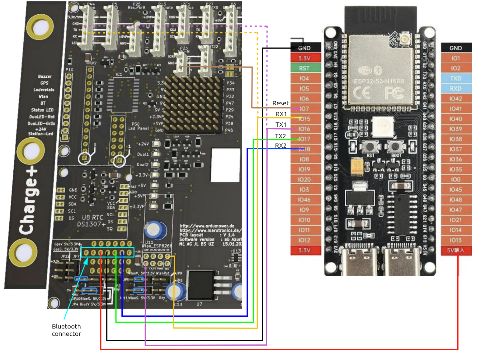

# ESP32-S3 Pinout – ArduMower PCB 1.3 / 1.4

This page describes how to wire an **ESP32-S3-DevKitC-1** (ESP32-S3-WROOM-1, 16 MB flash, 8 MB PSRAM) to the classic **ArduMower PCB 1.3 or 1.4** with an Arduino Due or Grand Central M4 running Sunray. For the MATRIX MOW800 with STM32 controller see [pinout.md](pinout.md).

## Connections

| ESP32-S3 | Signal | PCB connection | Purpose |
|----------|--------|----------------|---------|
| 5V input | 5V | Bluetooth connector, 5V | Power for the ESP32-S3 board |
| GND | GND | Bluetooth connector, GND | Common ground |
| GPIO17 | TX2 (ROUTER_TX) | Bluetooth connector, RX | Main mower UART: AT commands to Sunray (`Serial2`) |
| GPIO18 | RX2 (ROUTER_RX) | Bluetooth connector, TX | Main mower UART: answers from Sunray (`Serial2`) |
| GPIO15 | RX1 (TERMINAL_RX) | WLAN port `P44` / ESP8266 socket `U11`, TX | Terminal UART, optional (`Serial1`) |
| GPIO16 | TX1 (TERMINAL_TX) | WLAN port `P44` / ESP8266 socket `U11`, RX | Terminal UART, optional (`Serial1`) |
| GPIO7 | Reset (NRST) | `P23 (MP-R)` | Mower controller reset, optional |
| GPIO43 / GPIO44 | U0TXD / U0RXD | – | Debug console via the board's USB-to-UART port |

TX of one side always goes to RX of the other side.

## Jumpers

The ESP32-S3 GPIOs use 3.3V logic and are **not 5V tolerant**. Set the signal level of every port the ESP32-S3 is connected to to 3.3V before powering up:

| Jumper | Setting | Meaning |
|--------|---------|---------|
| `JP10 (BlueS)` | **3.3V** | Signal level of the Bluetooth connector (main UART) |
| `JP4 (BlueV)` | 5V | Supply voltage on the Bluetooth connector (powers the ESP32-S3 board) |
| `JP11 (WlanS)` | **3.3V** | Signal level of the WLAN port, only needed when the terminal UART is connected |

## Notes

- **Main UART (required):** The Bluetooth connector carries Sunray's AT command channel. This is all MowMate needs to control the mower, show its state and upload maps. It runs at Sunray's `BLE_BAUDRATE`, 115200 baud by default, which matches the modem.
- **Terminal UART (optional):** Connect GPIO15/16 to the WLAN port only if you want Sunray's console output in the web terminal.
- **Reset (optional):** GPIO7 lets the modem restart the mower controller through `P23 (MP-R)`.
- **No STM32 OTA:** GPIO5 (`BOOT0`) is not used. Flashing the mower firmware over the modem's STM32 bootloader path applies to STM32 boards like the MOW800 only, not to the Arduino Due or Grand Central M4.
- **Bluetooth module:** The ESP32-S3 takes the place of the Bluetooth module on the Bluetooth connector. Remove an existing Bluetooth module first.

General ESP32-S3 details (USB console, RGB LED, reserved pins, power supply) are the same as on the MOW800 and described in [pinout.md](pinout.md).
